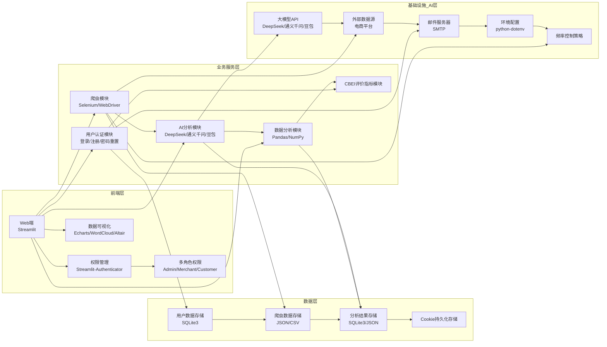

# 电商智能选品分析系统 - 系统架构图

## 架构说明

### 1. 前端层
- **Web端**：基于Streamlit框架开发，提供响应式用户界面
- **权限管理**：基于Streamlit-Authenticator，实现三级权限控制
  - **管理员**：可访问所有功能，包括用户管理
  - **商家**：可访问自己商品的销量趋势分析，每日10次免费深度分析机会
  - **客户**：可访问商品销量分析，但看不到趋势图，每日限3次体验机会
- **数据可视化**：基于Echarts、WordCloud和Altair，实现多维度数据展示

### 2. 业务服务层
- **爬虫模块**：基于Selenium、WebDriver和webdriver-manager，采用3线程低并发架构，模拟真人随机操作，实现安全稳定的数据采集
- **AI分析模块**：集成DeepSeek、通义千问、豆包等大模型API，实现多模型、高精度的情感分析和趋势预测
- **数据分析模块**：基于Pandas和NumPy，实现高效的数据处理和计算
- **用户认证模块**：处理用户登录、注册和密码重置功能
- **CBEI评价指标模块**：实现价格合理性、商家服务水平、物流配送体验和产品质量四个维度的评价指标

### 3. 数据层
- **用户数据存储**：使用SQLite3存储用户信息、角色权限和接口调用额度
- **爬虫数据存储**：使用JSON或CSV存储爬取的评论数据
- **分析结果存储**：使用SQLite3或JSON存储分析结果
- **Cookie持久化存储**：实现状态保持，减少重复验证

### 4. 基础设施/AI层
- **大模型API**：集成DeepSeek、通义千问、豆包等大模型，用于情感分析和智能洞察
- **外部数据源**：电商平台（如天猫/淘宝），提供评论数据
- **邮件服务器**：用于发送密码重置链接
- **环境配置**：使用python-dotenv管理环境变量
- **频率控制策略**：实现访问频率控制，减少被反爬概率

## 技术栈

| 模块 | 技术方案 | 关键特性 |
|------|---------|----------|
| 前端开发 | Python3.11+, Streamlit | 轻量高效、快速开发、响应式 |
| 数据智能采集 | Selenium、WebDriver、webdriver-manager、Python 多线程 | 减少被反爬概率、适度频率并发、自动适配驱动 |
| 数据处理与计算 | Pandas、NumPy、JSON、CSV | 高效清洗、结构化、易导出 |
| AI 智能分析 | DeepSeek、通义千问、豆包等大模型 | 多模型、高精度、趋势预测 |
| 多角色权限管理 | Streamlit-Authenticator、SQLite3 | 三级权限、额度管控、安全认证 |
| 数据可视化 | Echarts、WordCloud、Altair | 多图表、交互性、直观呈现 |
| 数据库与存储 | SQLite3、Cookie 持久化、本地文件存储 | 轻量本地、状态保持、易读写 |
| 系统部署与安全 | python-dotenv、频率控制策略、标准化错误处理 | 本地部署、密钥安全、减少封禁概率 |

## 数据流

1. **用户认证与权限控制**：用户通过前端层登录系统，系统根据角色权限显示相应功能
2. **数据采集**：爬虫模块采用3线程低并发架构，模拟真人随机操作，从电商平台获取评论数据
3. **数据清洗与标准化**：对采集的数据进行清洗、去重、脱敏处理，确保数据纯净有效
4. **AI分析**：集成多款国产大模型API，对评论数据进行情感分析和智能洞察
5. **CBEI评价指标计算**：基于清洗后的数据计算价格合理性、商家服务水平、物流配送体验和产品质量四个维度的评价指标
6. **数据分析与可视化**：通过Pandas、NumPy进行数据处理，使用Echarts、WordCloud和Altair实现多维度数据展示
7. **数据存储**：将用户数据、爬虫数据和分析结果存储到SQLite3、JSON或CSV中
8. **预警监控**：系统设置销量±10%波动阈值，触发异常时通过网页弹窗自动预警
9. **频率控制**：实现访问频率控制，减少被反爬概率，保障系统长期稳定运行